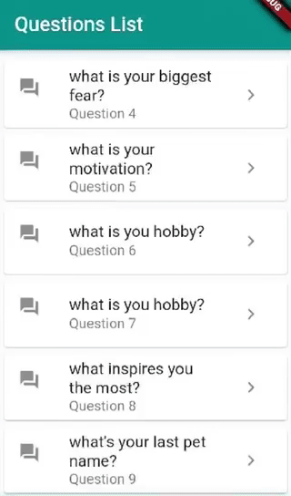

# flutter-app-speech-to-text
#stt plugin.

A new Flutter project that has a hard-coded static list of questions. using speech-to-text recognition plugin the application displays whatever you say. 

* DONE: 
  - speech to text recognition plugin works offline.
  - allows the application to listen to what you're saying while displaying it in text on the same screen.

* TODO:
  - save the displayed text(answer)on firebase db /or locally.
  - retreive data from firebase and update it directry.
  
* NOTE: 
- The app runs on a real android device only because of some plugin issues, probably due to the issue with the stt plugin mentioned in the documentation https://pub.dev/packages/speech_to_text.  

  #This is how the app looks like so far:

  
