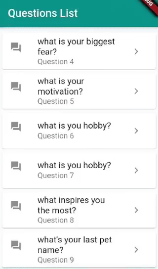

# flutterapp

A new Flutter project that has a static list of questions. using speech to text recognition you can record your answer. 

* what's available: 
  - speech to text plugin works offline. it allows the application to listen to what you're saying while displaying it in text on the same screen.

* what's missing:

  - save the displayed text feature on firebase db /or locally.( work in progress).

  

  This is how the app looks like:

  

## Getting Started

This project is a starting point for a Flutter application.

A few resources to get you started if this is your first Flutter project:

- [Lab: Write your first Flutter app](https://flutter.dev/docs/get-started/codelab)
- [Cookbook: Useful Flutter samples](https://flutter.dev/docs/cookbook)

For help getting started with Flutter, view our
[online documentation](https://flutter.dev/docs), which offers tutorials,
samples, guidance on mobile development, and a full API reference.
